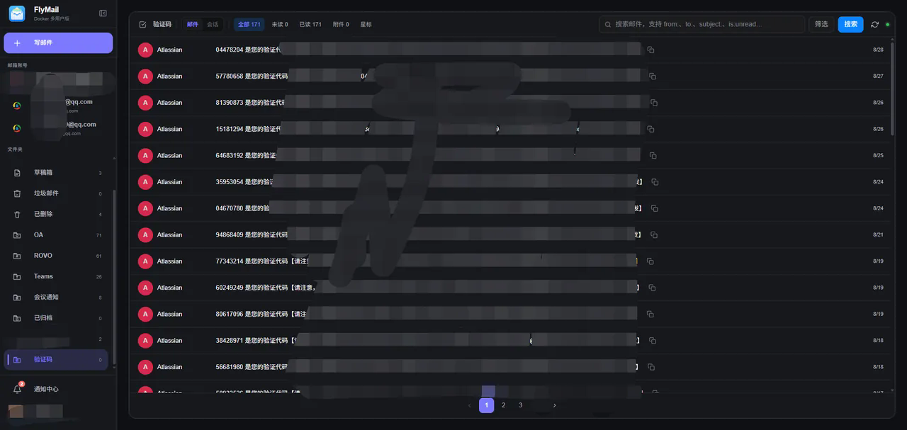
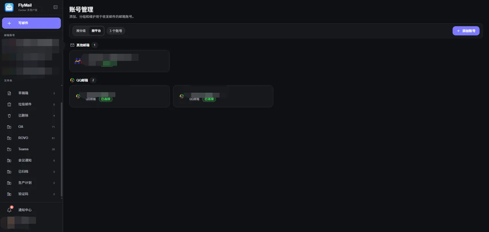
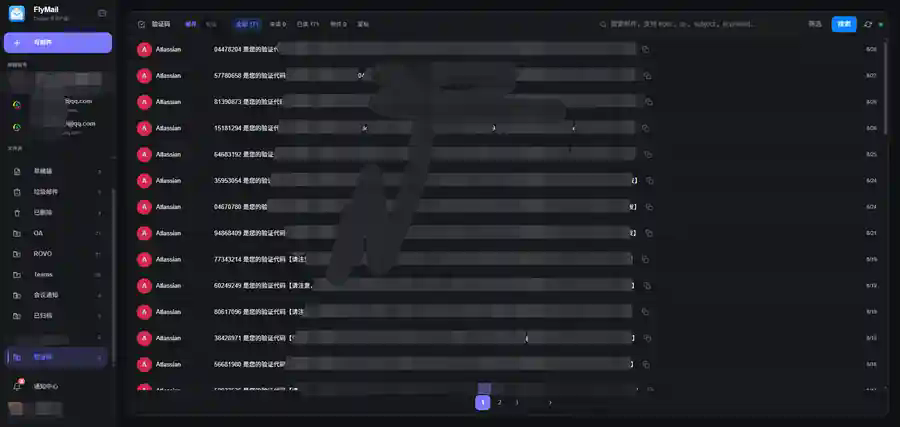

# FlyMail

一个面向 Docker 部署的多用户 Web 邮件客户端。

FlyMail 基于 FastAPI + Vue 3 构建，支持在一个实例中管理多个用户和多个邮箱账号，并通过 IMAP / SMTP、OAuth、授权码等方式接入常见邮箱服务。应用、前端静态资源和 MySQL 8.0 运行在同一个 Docker 容器中，业务数据统一持久化到 `/data`。

> 当前版本：`0.0.61`

## 界面预览

### 邮件列表

支持邮件 / 会话视图、用户级默认显示方式、关键词与高级筛选、未读状态、附件状态，以及常见数字验证码识别与一键复制。



### 账号管理

多个邮箱账号可以按平台或分组管理，并支持调整全局邮箱顺序、自定义账号图标、禁用和重新授权。



### 设置

提供主题、邮件列表默认显示方式、聚合收件箱、签名、附件缓存、定时清理以及 Gmail 代理等用户级设置。



## 核心能力

- **多用户隔离**：本地用户名密码登录，管理员可以创建、禁用用户和重置密码；邮箱账号、邮件缓存、联系人、签名、通知与用户设置按用户隔离。
- **多邮箱管理**：支持 Gmail、Outlook、QQ、网易、iCloud、新浪和通用 IMAP / SMTP 邮箱。
- **邮件收发**：支持收件、回复、转发、草稿、抄送、密送、附件、内嵌图片以及定时发送；邮件详情按实际邮件头显示发件人、收件人、抄送和密送信息，普通附件集中显示在正文上方。
- **历史与增量同步**：历史邮件后台同步支持暂停、继续、重试和断点恢复；在线账号持续同步新邮件与已读状态。
- **本地搜索**：已同步邮件可在 MySQL 本地缓存中搜索，支持 `from:`、`to:`、`subject:`、`after:`、`before:`、`has:attachment`、`is:unread`、`is:read`、`is:starred` 等条件。
- **邮件会话**：优先使用标准 `Message-ID`、`References` 和 `In-Reply-To` 组织会话，兼容旧缓存的保守主题回退；会话内按最新到最早排列，阅读时隐藏常见客户端自动附带的历史引用内容。
- **验证码识别**：在主题和已缓存正文中识别常见 4–8 位数字验证码，列表中可直接复制；复制未读邮件中的验证码后会同步标记为已读。
- **附件缓存与预览**：普通附件按需下载，内嵌图片随正文缓存；缓存对象按 SHA-256 去重，并支持用户级容量限制与 LRU 清理。图片、PDF、纯文本、音频和视频等浏览器原生类型可直接预览，HTML、SVG、Office、压缩包等类型保持下载处理。
- **联系人与签名**：支持联系人管理、从本地往来邮件提取候选联系人，以及多签名、账号默认签名和签名内嵌图片。
- **邮件备份**：支持将邮件归档为 `.eml`，默认保存到 `/data/flymail/backup`，也可以使用额外挂载到 `/data` 下的授权目录。
- **实时通知**：通过 WebSocket 推送新邮件、定时发送和备份结果，并支持 Bark、Telegram、企业微信、钉钉、飞书和通用 Webhook。
- **响应式界面**：支持浅色、深色、跟随系统主题，以及桌面端和移动端布局。

## 支持的邮箱

| 邮箱 | 接入方式 | 说明 |
| --- | --- | --- |
| Gmail | OAuth 2.0 | 支持用户级 HTTP CONNECT 代理，覆盖 OAuth、IMAP、SMTP 与 IDLE |
| Outlook / Hotmail | OAuth 2.0 | 使用 Microsoft OAuth 授权 |
| QQ 邮箱 | 授权码 | IMAP / SMTP |
| 网易邮箱 | 授权码 | IMAP / SMTP |
| iCloud Mail | App 专用密码 | IMAP / SMTP |
| 新浪邮箱 | 授权码 | 支持 `sina.com`、`sina.cn`、`2008.sina.com` 及 VIP 邮箱 |
| 其他邮箱 | 用户名 / 密码或授权码 | 自定义公网 IMAP / SMTP，支持 SSL 或 STARTTLS |

第三方邮箱是否可用取决于服务商设置、账号授权状态、网络环境和代理条件。FlyMail 的健康检查通过，只代表 FlyMail 服务本身可访问，不代表所有邮箱服务商都能连接。

## 快速部署

### 1. 克隆项目

```bash
git clone https://github.com/LiangLiang723/flymail.git
cd flymail
```

### 2. 创建环境文件

```bash
cp .env.example .env
```

至少修改管理员密码、数据库密码和会话签名密钥：

```env
APP_PORT=8080
FLYMAIL_DATA_PATH=./data
FLYMAIL_BASE_PATH=

FLYMAIL_ADMIN_USERNAME=admin
FLYMAIL_ADMIN_PASSWORD=change_me_please
FLYMAIL_SESSION_SECRET=replace_with_a_long_random_secret

MYSQL_DATABASE=flymail
MYSQL_USER=flymail
MYSQL_PASSWORD=flymail
```

`FLYMAIL_SESSION_SECRET` 必须至少 16 个字符，建议使用：

```bash
openssl rand -hex 32
```

### 3. 启动

```bash
docker compose up -d --build
```

启动后访问：

```text
http://<服务器地址>:8080
```

默认健康检查接口：

```text
GET /api/health
```

### 4. 查看状态与日志

```bash
docker compose ps
docker compose logs -f flymail-app
```

停止服务：

```bash
docker compose down
```

> `docker compose down` 不会删除已经挂载到 `/data` 的持久化数据。不要使用 `down -v` 或手动删除数据目录，除非你明确要清空实例数据。

## Docker 结构

当前镜像为单容器部署：

```text
Host
├─ APP_PORT -> container:8080
└─ FLYMAIL_DATA_PATH -> /data

Container
├─ FlyMail / FastAPI       0.0.0.0:8080
├─ Vue 3 静态资源
└─ MySQL 8.0               127.0.0.1:3306
```

MySQL 只监听容器内部 `127.0.0.1:3306`，不会映射到宿主机。

本地构建镜像：

```bash
docker build -t benxianyu/flymail:0.0.61 .
```

## 数据持久化

所有需要保留的数据都位于容器 `/data` 下：

```text
/data
├─ mysql/                         # MySQL 数据文件
├─ mysql-files/                   # MySQL secure-file-priv
└─ flymail/
   ├─ config/                     # 应用配置、调度任务等
   ├─ backup/                     # .eml 邮件备份
   ├─ files/
   │  ├─ uploads/                 # 写信临时上传
   │  ├─ avatars/                 # 用户头像
   │  ├─ account-icons/           # 自定义邮箱图标
   │  ├─ signature-images/        # 签名图片
   │  └─ objects/sha256/          # 附件与内嵌图片对象缓存
   └─ logs/                       # 运行日志
```

只要宿主机的 `FLYMAIL_DATA_PATH` 没有被删除，即使重新创建容器，用户、邮箱账号、邮件缓存、附件和配置仍会保留。

## 常用配置

完整示例见 [`.env.example`](.env.example)。

| 变量 | 默认值 | 作用 |
| --- | --- | --- |
| `APP_PORT` | `8080` | 宿主机访问端口 |
| `FLYMAIL_DATA_PATH` | `./data` | 宿主机持久化目录 |
| `FLYMAIL_BASE_PATH` | 空 | 反向代理子路径，例如 `/mail` |
| `FLYMAIL_ADMIN_USERNAME` | `admin` | 首次启动初始化管理员用户名 |
| `FLYMAIL_ADMIN_PASSWORD` | `change_me_please` | 首次启动初始化管理员密码 |
| `FLYMAIL_SESSION_SECRET` | - | 会话签名密钥，至少 16 个字符 |
| `MYSQL_DATABASE` | `flymail` | 内置 MySQL 数据库名 |
| `MYSQL_USER` | `flymail` | 内置 MySQL 业务账号 |
| `MYSQL_PASSWORD` | `flymail` | 内置 MySQL 业务账号密码 |
| `FLYMAIL_HTTP_PROXY` | 空 | HTTP 出站代理 |
| `FLYMAIL_HTTPS_PROXY` | 空 | HTTPS 出站代理 |
| `FLYMAIL_ALL_PROXY` | 空 | 全局出站代理 |
| `FLYMAIL_NO_PROXY` | `127.0.0.1,localhost` | 不经过代理的地址 |

`.env` 不应提交到 Git。邮箱密码、授权码、OAuth Token、Cookie、数据库密码和会话密钥也不应出现在仓库或日志中。

## 同步、缓存与离线行为

FlyMail 会把邮件摘要、已获取的正文和附件元数据写入本地 MySQL。普通附件在首次打开时按需下载到文件缓存；内嵌图片会随正文同步。

因此邮箱暂时离线或登录失效时：

- 已同步的邮件摘要仍可查看和搜索；
- 已缓存的正文、附件和内嵌图片仍可访问；
- 尚未缓存的附件需要邮箱重新在线后才能获取；
- 本地搜索只覆盖当前用户已经同步到 FlyMail 的内容。

验证码识别属于确定性启发式规则，目标是减少订单号、日期、电话号码等误报，不保证覆盖所有服务商，也不保证识别字母数字混合验证码。

## 安全边界

- 用户数据默认按用户隔离，普通用户不能访问其他用户的邮箱账号和本地邮件数据。
- 会话 Cookie 使用服务端签名，`FLYMAIL_SESSION_SECRET` 不应复用默认值。
- 数据库仅在容器内部监听，不对宿主机暴露 3306 端口。
- 通用邮箱服务器必须解析到公网地址，避免通过自定义 IMAP / SMTP 配置访问回环、内网或链路本地地址。
- 代理 URL 中可以包含认证信息，但 FlyMail 不应把代理密码、邮箱授权码、OAuth Token、数据库密码和会话密钥写入日志。

如果 FlyMail 暴露到公网，建议在前面部署 HTTPS 反向代理并配合访问控制、防火墙和可靠备份。

## 本地开发

### 后端

```bash
cd backend
python -m venv .venv
source .venv/bin/activate
pip install -r requirements.txt
python main.py
```

### 前端

```bash
cd frontend
npm install
npm run dev
```

前端生产构建：

```bash
cd frontend
npm run build
```

后端测试：

```bash
cd backend
python -m unittest discover -s tests -v
```

## 项目结构

```text
flymail/
├─ backend/                  # FastAPI 后端、IMAP / SMTP、同步和缓存逻辑
├─ frontend/                 # Vue 3 前端
├─ scripts/                  # Docker 入口脚本、版本同步脚本
├─ doc/                      # 项目文档与 README 截图
├─ docker-compose.yml
├─ Dockerfile
├─ VERSION                   # 版本唯一事实来源
└─ README.md
```

## 更多文档

- [UI 设计与布局约束](DESIGN.md)
- [API 接口文档](doc/API接口文档.md)
- [Docker 多用户重构设计](doc/2026-06-30-docker-multi-user-refactor-design.md)
- [历史邮件同步设计记录](doc/history-sync-design-2026-06-30.md)

## 致谢

感谢原项目 [DinDing1/FlyMail](https://github.com/DinDing1/FlyMail)。当前仓库在此基础上重构为独立 Docker 多用户版本，不再依赖飞牛应用中心运行环境。

## License

[GPL-3.0](LICENSE)
